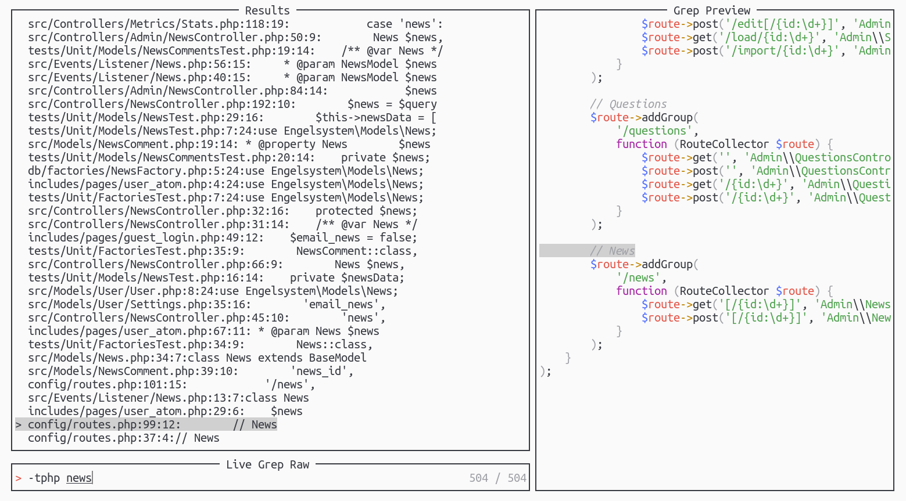

<!--
SPDX-FileCopyrightText: 2021 Michael Weimann <mail@michael-weimann.eu>

SPDX-License-Identifier: CC0-1.0
-->

# Telescope live grep args

[](https://api.reuse.software/info/github.com/nvim-telescope/telescope-live-grep-args.nvim)

Live grep args picker for [telescope.nvim](https://github.com/nvim-telescope/telescope.nvim).




## What it does

It enables passing arguments to the grep command, `rg` examples:

- `--no-ignore foo`
- `"foo bar" bazdir`


## Installation

### Packer

Add `telescope-live-grep-args.nvim` as `telescope.nvim` dependency, e.g.:

```lua
use {
    "nvim-telescope/telescope.nvim",
    requires = {
        { "nvim-telescope/telescope-live-grep-args.nvim" }
    }
}
```


## Usage

Load the extension

```lua
require("telescope").load_extension("live_grep_args")
```

Then call or map this command

```
:lua require("telescope").extensions.live_grep_args.live_grep_args()
```


### Grep argument examples:

| prompt | args |
| --- | --- |
| `foo bar` | `foo bar` |
| `"foo bar" baz` | `foo bar`, `baz` |
| `--no-ignore "foo bar` | `--no-ignore`, `foo bar` |

If the prompt value does not begin with `'`, `"` or `-` the entire prompt is treatet as a single argument.
This behaviour can be turned off by setting the `auto_quoting` option to `false`.


## Configuration

```lua
local telescope = require("telescope")
telescope.setup {
  extensions = {
    live_grep_args = {
      auto_quoting = true, -- enable/disable auto-quoting
    }
  }
}
```

## Development

### Running the tests

- Clone [plenary.nvim](https://github.com/nvim-lua/plenary.nvim) next to this repo
- `make test`


## Acknowledgements

Based on the idea of this [pull request](https://github.com/nvim-telescope/telescope.nvim/pull/670).
