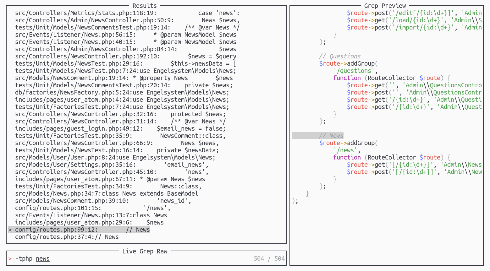

<!--
SPDX-FileCopyrightText: 2021 Michael Weimann <mail@michael-weimann.eu>

SPDX-License-Identifier: CC0-1.0
-->

# Telescope live grep raw

[](https://api.reuse.software/info/github.com/nvim-telescope/telescope-live-grep-raw.nvim)

Live grep raw picker for [telescope.nvim](https://github.com/nvim-telescope/telescope.nvim).




## What it does

It passes the entire prompt to the grep command additionally to the vimgrep options.


## Installation

### Packer

Add `telescope-live-grep-raw.nvim` as `telescope.nvim` dependency, e.g.:

```lua
use {
    'nvim-telescope/telescope.nvim',
    requires = {
        { 'nvim-telescope/telescope-live-grep-raw.nvim' }
    }
}
```


## Usage

Load the extension

```lua
require('telescope').load_extension('live_grep_raw')
```

Then call or map this command

```
:lua require('telescope').extensions.live_grep_raw.live_grep_raw()
```

You can also call it passing arguments similar to `builtin.live_grep`

```
:lua require('telescope').extensions.live_grep_raw.live_grep_raw({vimgrep_arguments={ ... }})
```

Note that for `vimgrep_arguments` some `rg` options are required for the output to be in the right format to parse. Below are the minimal recommended and default options. Check `:help vimgrep_arguments` for details

```lua
vimgrep_arguments = {
  'rg',
  '--color=never',
  '--no-heading',
  '--with-filename',
  '--line-number',
  '--column',
  '--smart-case'
},
```

Also accepts other options. For example

```
:lua require('telescope').extensions.live_grep_raw.live_grep_raw({theme='dropdown'})
```

## Configuration
 
The `live_grep_raw` extension configuration is similar to `builtin.live_grep` picker. You can configure it by adding this to your telescope extensions setup

```lua
local telescope = require 'telescope'
telescope.setup{
  extensions = {
    live_grep_raw = {
      vimgrep_arguments = {
        'rg',
        '--color=never',
        '--no-heading',
        '--with-filename',
        '--line-number',
        '--column',
        '--smart-case'
      },
      -- ... also other pickers settings, for example:
      -- theme = 'dropdown', -- use dropdown theme
      -- path_display = ..., -- set how file path are displayed
      -- mappings = {i={...}, ...}, -- add mappings specific to this picker
      -- previewer = false, -- this show picker without preview pane
      -- layout_config = { mirror=true }, -- mirror preview pane
    }
  }
}

telescope.load_extension('live_grep_raw')
```


## Development

### Running the tests

- Clone [plenary.nvim](https://github.com/nvim-lua/plenary.nvim) next to this repo
- `make test`


## Acknowledgements

Based on the idea of this [pull request](https://github.com/nvim-telescope/telescope.nvim/pull/670).
